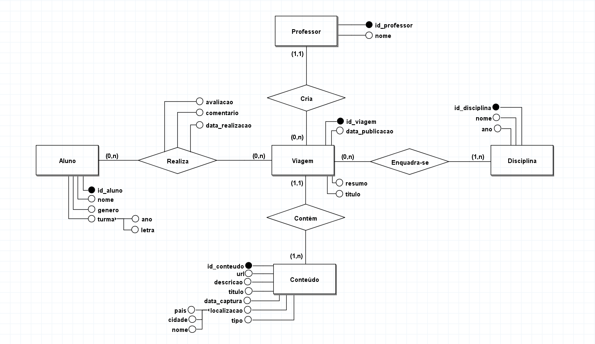
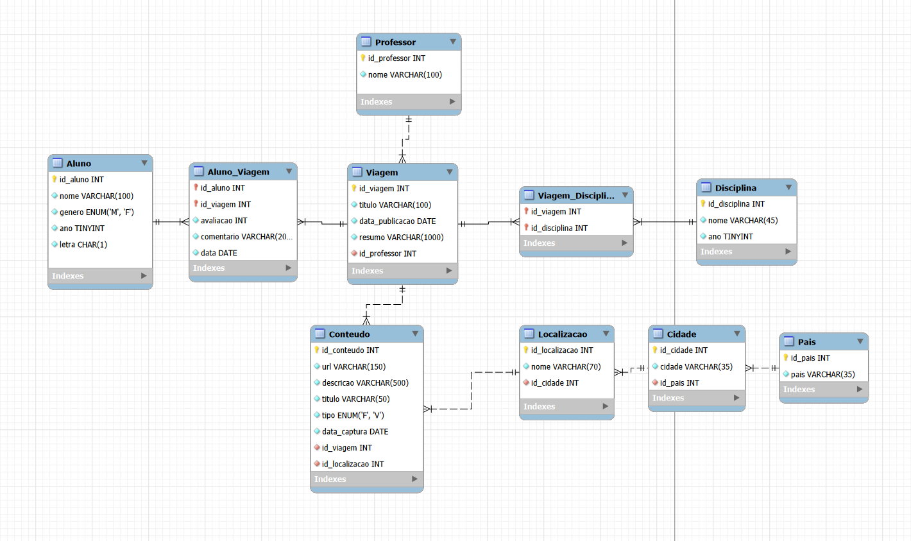

# Novos Horizontes 🌍✈️

Sistema de base de dados relacional para catalogação e gestão de viagens virtuais pedagógicas, desenvolvido no âmbito da Unidade Curricular de **Bases de Dados** (2025/2026) na Universidade do Minho.

## 📝 Descrição
O projeto consistiu na criação de um SBD centralizado para a Escola Novos Horizontes, permitindo a gestão de conteúdos multimédia, interações de alunos e controlo de acessos (RBAC). O sistema garante a integridade dos dados e otimiza a pesquisa de recursos educativos.

## 🖼️ Modelação
### Modelo Conceptual
Representação das entidades e relações através de um Diagrama Entidade-Relacionamento (DER).



### Modelo Lógico
Esquema relacional normalizado até à **3ª Forma Normal (3FN)** para garantir a eficiência e ausência de redundâncias.



## 📂 Estrutura do Projeto

```text
novos-horizontes/
│
├── modelo-conceptual/
│   ├── ModeloConceptualNH.brM3    # Ficheiro brModelo
│   └── ModeloConceptualNH.png     # Imagem do Diagrama ER
│
├── modelo-logico/
│   ├── ModeloLogicoNH.png         # Imagem do Modelo Relacional
│   └── ModeloLogicoNH.mwb         # Modelo Lógico do MySQL Workbench
|
├── relax/
│   └── script_relax.txt           # Script para validação em Álgebra Relacional
│
├── sql/
│   ├── creation.sql               # Scripts DDL (Tabelas)
│   ├── indexes.sql                # Criação de índices
│   ├── views.sql                  # Criação de vistas
│   ├── functions.sql              # Criação de funções
│   ├── procedures.sql             # Criação de stored procedures
│   ├── triggers.sql               # Criação de gatilhos
│   ├── population.sql             # Scripts DML (Povoamento de dados)
│   ├── queries.sql                # Interrogações dos requisitos de manipulação
│   ├── roles.sql                  # Scripts DCL (Definição de permissões - RBAC)
│   └── users.sql                  # Scripts DCL (Criação de utilizadores e atribuição de roles)
│
├── Relatorio_BD.pdf               # Relatório do projeto
└── README.md                      # Ficheiro README
```

## 👥 Autores
* **Matheus Azevedo** - [GitHub](https://github.com/matheusm18)
* **Afonso Barros** - [GitHub](https://github.com/barros-11)
* **Diogo Pedrosa** - [GitHub](https://github.com/)
* **Luís Pedrosa** - [GitHub](https://github.com/)
